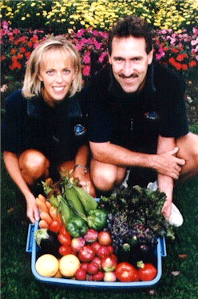
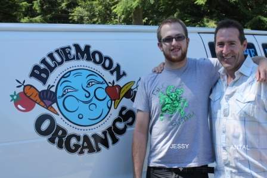

In business since 1997, Blue Moon Organics has experienced tremendous growth due to the growing public interest in organically farmed produce. Owners Kelly and Antal Boros have been featured in local community newspaper articles and constantly receive rave reviews from their many customers.

Discover the convenience of having fresh Certified Organic Fruits and Vegetables delivered right to your home and re-discover the great taste of our grandparents’ era! Call Blue Moon Organics today, or SIGN UP right now!

Enjoy the fruits and vegetables of the time honoured ways of farming before the widespread use of agrochemicals! Blue Moon Organics makes it easy and affordable for you.

As a customer of Blue Moon Organics, you’ll receive a fresh selection of Certified Organic fruits and vegetables delivered right to your door, weekly or bi-weekly. It’s a convenient and cost-effective way to enjoy produce free of synthetic pesticides and herbicides.

Blue Moon Organics has seen tremendous growth and a growing public interest in organically farmed produce. Re-discover the great taste of our grandparents’ era. Visit our product profile page and discover how convenient home delivery can be. Call Blue Moon Organics today, or sign up right now!

## Here’s what our customers are saying about Blue Moon Organics!

> Hi to all at Blue Moon,
>
> I thought I would take a minute and write this to you to tell you how much we love all the fruits and vegetables we get each week. Since signing on in October (I think), we have loved the variety and quality of the produce. I have a daughter who hates broccoli but has to admit the broccoli we get from you tastes really good. I have never tasted broccoli so sweet. It amazes me each time I eat an apple how wonderful they taste.
>
> Yes, they actually “taste”! The red romaine has been beautiful. My other daughter dislikes potatoes but again, has to admit, the ones we get in the bin taste really good! We love peeking inside each week to see what is there and I just build meals around what comes. I have not gone to the store for produce since receiving your bins. I cringe at the thought. Even the store bought organic doesn’t taste as good. It is also nice to be able to just “budget” that amount. So, as we ate our way through another bin, I thought perhaps I would pass along how very much we love to receive them and how much we appreciate Blue Moon Organics for making this wonderful produce available to us!
>
> — Robyn, Maple Ridge

***

> I have been a customer for about 4 years now, maybe longer. I feel that I am still a new customer because your service is exceptional and each box is so fresh and plentiful that its like the first one received. My kids love fruits and vegetables now and Im so happy that I am able to give them such high quality produce when Im so busy with everything else to do with raising a family. Thank you very much.
>
> — Sandra, Anmore

***

> Thank you so much for everything. We are so happy with Blue Moon – it is a much better experience than we’ve had with the larger organic companies. The service is second-to-none and the quality of your produce is outstanding! Each box is so fresh, and delicious. Thanks for the wonderful experience.
>
> — _Leslie & John_

***

> Thank you for another great year of produce. My kids now eat all sorts of produce that they would not even try before. It is comforting to have you show up with all sorts of things that we would not otherwise try.
>
> — _Heather, Port Coquitlam_

***

> Your fabulous organic veggies – what delight! It reminds me of sampling fresh veggies as I walked through Grandma’s garden. Even my extremely fussy little girl and wife are enjoying their treats fresh or lightly steamed. What a great, thoughtful, healthy lifestyle you are encouraging. Thanks!
>
> — _Ed, Belcarra_

***

> Great veggies, great service, great people! Highly recommend Blue Moon Organics.
>
> — _Kathy (mother of 5), Port Coquitlam_

***

> As a mother of 3 teenagers I am always looking for new healthy ways to prepare meals. I find Blue Moon Organics my answer. The fruits and vegetables are always excellent. I use and enjoy the recipes, they help me try new veggies I wouldn’t ordinarily purchase.

> — _Molly, Port Coquitlam_

***

> I was introduced to Blue Moon Organics, by Antal arriving at my door, September, 1997, with a container full of produce and an offer to try it. We discovered carrots, apples and oranges that tasted like none I had ever had before. WOW!
>
> I had been intellectually committed to organic produce before but had been turned off by the high prices and not wonderful looks of produce in the health food store. But this stuff was unblemished and tastes awesome. We have been passionate supporters of Blue Moon ever since.
>
> Along with the incredible taste and the feeling that I am giving my family the best quality with no possible harm, I especially like the variety of produce my family and I are exposed to through the delivery system. We can always say no to something unusual but usually we try it and then are pleasantly surprised–and if the kids don’t like something there is more high nutrition and taste for mom!
>
> — _Sylvia, Port Coquitlam_

***

> My husband and I have been enjoying Blue Moon Organics for several months and are so pleased with the unexpected lifestyle changes! I spend less time in supermarkets now that all my produce comes right to my door. I’m sure I spend less money overall on produce now – yet seem to always have more on hand!
>
> I sent a box of your vegetables to two neighbors and it turned out to be one of the most appreciated gifts I have ever given. Healthier than candy and and like “found money” the household budget!
>
> Thanks for providing such a superb product and service.
>
> — _Paulette, Coquitlam_

***

> We are extremely pleased with the freshness and flavour of the organic vegetables. There is a noticeable difference from grocery store vegetables and the service of delivery to our doorstep is a wonderful time saver for a busy family.
>
> Blue Moon Organics is always trying to improve their already excellent service to their customers.
>
> — _Michelle, Anmore_

***

> Just a note as we pass our first year of your very special organic food delivery. First and foremost we must mention we are extremely pleased with the high quality, freshness and bold taste of everything. We especially like your referral system as many of our friends and associates now enjoy what we have become accustomed to.
>
> Thanks again and good luck.
>
> — _Mark & Pat, Port Moody_

***

> Blue Moon Organics provides me with top quality organic produce at a very reasonable price. The weekly bins always have some new treat to try and the service is friendly and helpful. All this – and home delivery too!
>
> — _Lisa, Maple Ridge_

***

> “Thankyou” for the excellent service you have always provided. You have gone above and beyond in every way!!
>
> — _Susan, Maple Ridge_

***

> We received our first shipment yesterday and we just wanted to let you know that the quality and freshness was wonderful and we are very pleased. We have been a customer of another organic home delivery for about 8 months and the quality has been very poor lately. We were able to open both bins side by side and compare the quality, difference wow– night and day!! Keep up the great shipments.
>
> — _Jamie, Coquitlam_

***

> I thank you for always answering my questions and standing behind your product. I can imagine how busy you get but you always take the time for your customers. I really appreciate that.
>
> — _Mary-Anne, Port Coquitlam_

***

> Gosh! You guys are great at customer service! We appreciate your fast and generous response. Thanks!
>
> _— Tammy & Steve, Maple Ridge_

***

> Thankyou again – BMO has given me and my family such great service. It’s been so reassuring to get high quality “good” produce for my little son (and his dad). Wishing you continued success.
>
> _— Karen, Port Coquitlam_

***

> We are so pleased with your choices and services. We thank you for helping us in our goal to eat healthy!
>
> — _Rhys, Maple Ridge_

***

> We love your yummy products!
>
> — _Andy & Jeanne, Port Coquitlam_

***

> We are so pleased that we joined Blue Moon Organics. Both the produce and the service are excellent! Thankyou!
>
> — _Cathy, Coquitlam_

***

> We have been so happy with everything Blue Moon Organics has provided us; your service and friendly professionalism, as well as great vegetables and fruits.
>
> _Karen, Port Coquitlam_

***

> We love your service and quality of produce!!
>
> _Diana, Port Moody_

***

> Thankyou for providing us with healthy vegetables and fruits. All of our family appreciate your service.
>
> _Hsu, Coquitlam_

***

> Just wanted to let you know that we love our organic veggies! We now eat more veggies and fruits than ever before. The taste difference is quite amazing between “organic” and “the other”.
>
> _Derek & Suzi, Port Coquitlam_

***

> Last week’s delivery (our first from Blue Moon) was an amazing improvement over our last organics supplier. All the produce was great. Thanks and keep up the good work!
>
> _Murray, Port Moody_

***

> Your produce is GORGEOUS and your service is quite wonderful! I thank you again...
>
> — _Jan, Coquitlam_

***

> We have been purchasing our fruit and veggies from Blue Moon for a few months now and I believe it was one of the smartest decisions we made. We have three children and every Friday we get our bin delivered, the kids are so excited to see what we’ve received. Considering the quality of the produce, the great customer service and delivery to your door, the cost of this service is very reasonable. I would encourage anyone (especially skeptics) to give Blue Moon Organics a try.
>
> — _Tanya and Mark_

***

> This food is good for smoothies. We think it is is very good.
>
> — _Cameron, age 10_
